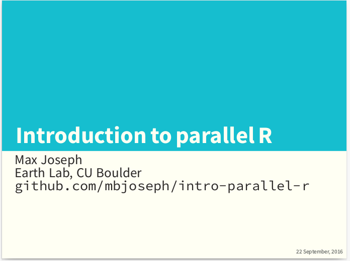

Introduction to parallel R
==========================

Sep 22, 2016

This material is associated with a presentation to the University of Colorado Computational Sciences and Engineering meetup group.
The slides are written in Rmarkdown and rendered to pdf via Beamer.
There are three examples to run on the CU supercomputer (Janus as of Sep 22, 2016) that demonstrate Rmpi, snow, and snowfall in a high performance computing environment.

The rendered slides are available on FigShare: https://figshare.com/articles/Introduction_to_parallel_R/3848310

